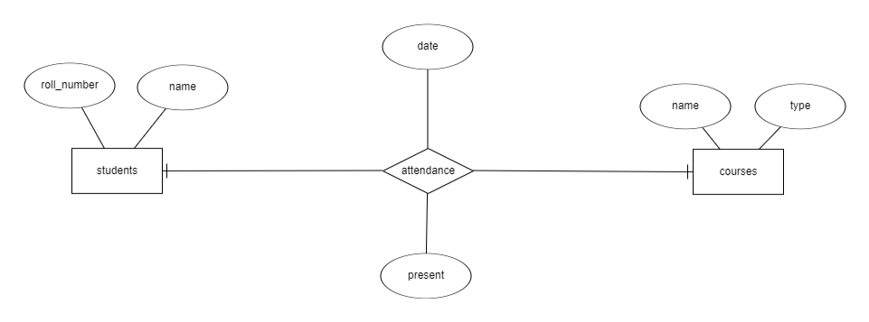

# celestial-syntax

## Team Members
- shaonirfan (Team Leader)
- Skalahuddin
- Bushra18433

## Mentor
- shakil-shahan

# 📌 Face Recognition-Based Attendance System

## 📖 Project Description
This project is a **Face Recognition-Based Attendance System** that automates attendance tracking using **OpenCV** and **Dlib**. It captures and compares individuals' images in real-time to mark attendance, stores the data in an **SQLite** database, and provides analytical insights such as **attendance percentage** and **student eligibility for exams**.

### 🔹 Features:
- 🎦 **Facial Recognition Attendance** - Uses OpenCV and Dlib to recognize faces and mark attendance.
- 📚 **Course-Wise Tracking** - Attendance is stored and retrieved per course.
- 📊 **Attendance Analysis** - Calculates total attendance and highlights students below the required threshold.
- 📝 **Automated Reports** - Generates attendance summaries and exam eligibility lists.
- 🌐 **Web-Based Interface** - Uses Flask to provide an interactive dashboard for attendance management.

---

## 🛠️ Technologies Used
- **Python** 🐍 - Main Programming Language
- **Flask** 🌎 - Web Framework for Backend
- **OpenCV & Dlib** 🎭 - Face Detection & Recognition
- **SQLite** 🗄️ - Database for Storing Attendance Records
- **HTML, CSS, JavaScript** 🎨 - Frontend for Web Interface
- **Bootstrap**  - Responsive UI Styling

---

## Project Architecture
Here is the ER diagram for our project:


### ✅ Prerequisites
Make sure you have **Python 3.8+** installed on your system.

## Getting Started
1. Clone the repository:
```bash
git clone https://github.com/Learnathon-By-Geeky-Solutions/celestial-syntax/
```
2. Install dependencies
3. Start development

## Development Guidelines
1. Create feature branches
2. Make small, focused commits
3. Write descriptive commit messages
4. Create pull requests for review

## Resources
- [Project Documentation](docs/)
- [Development Setup](docs/setup.md)
- [Contributing Guidelines](CONTRIBUTING.md)
